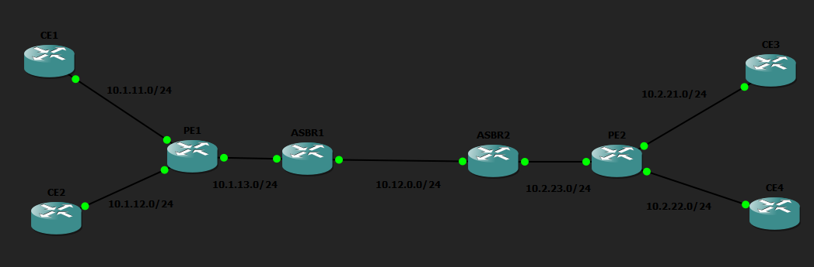

# PE Hardening



Using the existing Topology from the Inter-AS-MPLS-VPN Lab, security measures were implemented on PE1 so as to harden the router against cyber attacks. Multiple mechanisms were implemented in order to comply with the Defense in Depth method to secure the router.

### Measures implemented:
1. BGP GTSM (Generalised TTL Security Mechanism)
2. MD5 Authentication
3. CoPP (Control Plane Policing)
4. uRPF (Unicast Reverse Path Forwarding) Strict Mode
5. iACL Access Control Lists

### BGP GTSM

BGP GTSM is a security mechanism which is designed to protect against CPU-utilisation attacks by validating the TTL (Time To Live) value. The TTL value determines the lifespan of the data. When the TTL reaches 0, the packet is discarded. GTSM works by verifying the TTL value (which is usually set at 255) and the TTL hop value (usually set to 1).
-GTSM is configured on both ends of a BGP connection
-Valid TTL hops must match on both ends of the connection

```
router bgp 1
 address-family ipv4 vrf VPN1
  neighbor 10.1.11.1 ttl-security hops 1
 exit-address-family

 address-family ipv4 vrf VPN2
  neighbor 10.1.12.1 ttl-security hops 1
 exit-address-family
```

### MD5 Authentication

A PSK (pre-shared key) is configured to every BGP neighbour. The matching passwords must be configured on CE1, CE2, and ASBR1 otherwise the BGP sessions will be dropped.

```
router bgp 1
 address-family ipv4 vrf VPN1
   neighbor 10.1.11.1 password Ce1BgpPassword!
 exit-address-family

 address-family ipv4 vrf VPN2
  neighbor 10.1.12.1 password Ce2BgpPassword!
 exit-address-family
```

### CoPP

CoPP is a mechanism which protects the control plane by classifying traffic, rate limiting, and violation actions.

1. Access Control Lists are configued to classify different types of traffic.
```
ip access-list extended COPP_ROUTING
 permit tcp any any eq bgp
 permit tcp any eq bgp any
 permit ospf any any
 
ip access-list extended COPP_ICMP
 permit icmp any any
```

2. The class map command acts as a bucket to group traffic that is identified by the ACLs. By grouping traffic, the class map can be used to apply unified policies to the buckets.
```
class-map match-all CLASS_COPP_ROUTING
 match access-group name COPP_ROUTING
class-map match-all CLASS_COPP_ICMP
 match access-group name COPP_ICMP
```

3. Enforcing Rate Limiting by using the command police.
- In case of routing traffic, the router allows 500000 bits per second. Both actions are transmit, meaning it will not drop the traffic, but flag it instead. This is useful for critical traffic.
- However, for ICMP traffic, it has a strict limit of 500000 bps, and will drop traffic that exceeds this limit.
- The catch all "class-default" permits all other traffic that we have not classified using class maps with a strict limit of 100000 bps.
```
policy-map POLICY_COPP
 class CLASS_COPP_ROUTING
  police 500000 conform-action transmit exceed-action transmit
 class CLASS_COPP_ICMP
  police 50000 conform-action transmit exceed-action drop
 class class-default
  police 100000 conform-action transmit exceed-action drop
```

4. Binding policy to the control plane.
```
control-plane
 service-policy input POLICY_COPP

```

### uRPF

uRPF is a security mechanism on Cisco routers to prevent IP spoofing and malicious traffic. It validates the source IP address by checking if the address exists, with its corresponsing matching interface, in its routing tables. It discards packets without a valid source IP address, thereby mitigating DoS attacks. A prerequisite to implementing uRPF is the configuration of standard or extended access lists to deny invalid addresses.

```
interface GigabitEthernet2/0
 description Connects to CE1 (VPN1)
 ip verify unicast source reachable-via rx

interface GigabitEthernet3/0
 description Connects to CE2 (VPN2)
 ip verify unicast source reachable-via rx
```

### iACL
